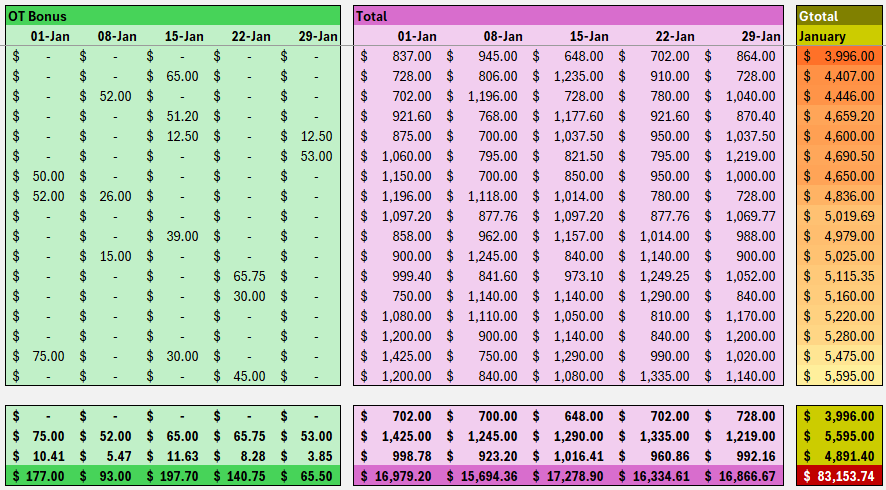

# Employee Payroll Management System – Microsoft Excel Project Portfolio

## Project Overview

The **Employee Payroll Management System** is a structured Excel-based payroll solution designed to efficiently calculate employee compensation, including basic pay, overtime, bonuses, and deductions. The payroll system leverages various Excel functions and formulas to automate calculations and ensure accuracy. This project demonstrates my ability to design, organize, and optimize payroll processes using Excel.

## Key Features

- **Employee Data Tracking**: Stores employee details, including employee ID, department, hourly rate, and total hours worked.
- **Automatic Salary Calculation**: Computes gross pay, overtime pay, and bonuses using predefined formulas.
- **Overtime Pay Management**: Applies `IF()` functions to determine overtime pay based on hours worked beyond standard limits.
- **Conditional Formatting**: Highlights employees eligible for overtime, bonuses, or deductions based on conditions.
- **Performance Metrics**: Uses `MIN()`, `MAX()`, `SUM()`, and `AVERAGE()` functions to analyze payroll trends.
- **Dynamic References**: Utilizes relative and absolute references for efficient data handling and calculations.
- **Payroll Summary Dashboard**: Visual representation of salary distribution and employee payroll breakdown.

## Formulas & Functions Used

```excel
=SUM(AC4:AG4)       // Calculates total earnings and deductions
=AVERAGE(C4:C20)   // Determines the average pay across employees
=IF(E4>40, E4-40, 0) // Determines overtime hours worked
=OR(E2>5000, F2<3000) // Applies conditional logic for payroll decisions
=MIN(G2:G10)       // Identifies the lowest salary
=MAX(G2:G10)       // Identifies the highest salary
```

## Data & Demonstration

The project utilizes synthetic data for demonstration purposes, representing a sample company with 10–50 employees across different departments. The dataset includes:

- **Employee ID & Name**
- **Hours Worked & Overtime Hours**
- **Hourly Rate & Basic Pay**
- **Bonus Allocation**
- **Total Earnings**
- **Deductions & Net Salary**

<p align="center">
  
  
</p>

## Conclusion

This payroll system showcases my proficiency in Microsoft Excel, my ability to design automated financial solutions, and my skills in data analysis and visualization. The project reflects a strong foundation in business operations, payroll management, and process optimization through advanced Excel techniques.


